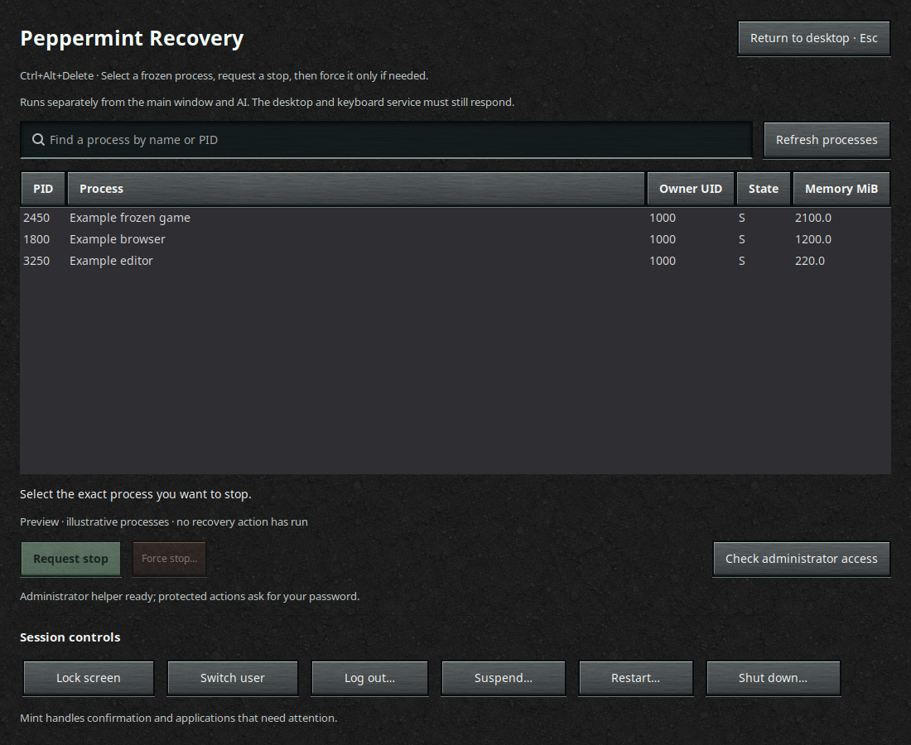

# Recovery and session controls — September 8, 2026

Implemented and installed on the current Linux Mint Cinnamon/X11 desktop. The
user requested Ctrl+Alt+Delete recovery during a freeze, administrator access,
the logout dialog's session choices, then a checkpoint before committing to
GitHub. No commit or push occurred during this phase.

## User-visible behavior

- Ctrl+Alt+Delete opens Peppermint Recovery fullscreen above other windows.
  Mint's original logout shortcut moved to Ctrl+Alt+Shift+Delete after checking
  it was unused. The wordless peppermint sidebar also includes Recovery;
  `peppermint recover` launches the same independent application.
- Search a bounded process snapshot by name/PID, select one process, then
  confirm Request stop. Force stop requires a termination timeout and a
  separate confirmation. Known critical display/session/system processes are
  blocked. Observed exit is reported separately from a request or timeout.
- Session controls combine Lock screen, Switch user, Log out, Suspend, Restart
  and Shut down on this host. Hibernate is hidden because current capability
  checks report it unavailable. Other unavailable controls are disabled.
- Logout/restart/shutdown use Mint's normal dialogs and inhibitor handling.
  Lock/switch/sleep first ask for explicit confirmation in Recovery. Recovery
  yields the screen for native dialogs and authentication; a timed-out request
  may still be pending and is never automatically retried.
- Escape or Return to desktop closes Recovery, including with search focused.
  The layout scrolls at small sizes so every control remains accessible.



The preview uses illustrative processes and replaces all process, administrator
and session actions. It was rendered at 1100×900. A second 660×560 render and GTK
allocation tests verified scrolling without allocation warnings.

## Installed integration

Cinnamon custom slot `custom0` is registered as Peppermint Recovery with command:

```text
/home/jesse/Documents/peppermint/.venv/bin/python -m peppermint.recovery.app
```

Existing custom1 and unrelated settings are preserved. Original full values
and unset/default state are backed up to
`~/.local/share/peppermint/recovery-shortcut-backup.json`. The installer checks
built-in and custom bindings, normalizes accelerator spellings and refuses
conflicts. Restoration preserves later user edits and reports skipped settings.

The standalone stdlib helper is installed at
`/usr/local/libexec/peppermint-recovery-helper`, root:root, mode 0755. `cmp`
confirmed it matches `peppermint/recovery/processes.py`; the helper and parent
directories pass ownership, symlink and write-permission checks. After native
administrator authentication, its read-only `--check` returned:

```json
{"status":"ok","message":"Recovery helper is available.","euid":0,"pidfd_available":true}
```

The GUI remains a normal-user process. Other-user stop requests use a fixed
`pkexec` helper invocation; the helper accepts only exact process identity and
an allowlisted signal action. It cannot run arbitrary commands. No password was
read/stored, no polkit rule was installed and no passwordless grant was added.
The local editable installation was refreshed without dependency downloads so
the `peppermint-recovery` entry point is also available.

## Implementation boundaries

- Recovery has its own GTK application/bus name and does not depend on the
  normal window, daemon or model. Worker threads handle bounded process reads,
  process actions, authentication and session calls. Late UI delivery is ignored
  after destruction. No process command line or environment is collected.
- Process scans are bounded by count and time. Actions bind PID, start ticks and
  UID to a pidfd, recheck executable/identity and refuse missing identity or
  unsupported pidfds. There is no raw `os.kill` fallback. TERM waits up to two
  seconds by default; an eventual force stop is a new explicit action.
- Authentication transport has a 120-second budget and bounded cancellation
  cleanup. An already authorized action may still finish after the window closes.
  Session work has a three-second budget covering bus connection and dispatch.
- Recovery requires Cinnamon's shortcut handling, display server and kernel to
  respond. It was verified against a frozen application, not a frozen compositor,
  display server or kernel. Root privileges do not guarantee graphical takeover
  under those failures. No SysRq, reboot target or kernel setting was changed.

## Validation

- `.venv/bin/python -m pytest tests -q`: **1,387 passed in 16.75s**.
  Recovery coverage includes 49 process tests, 50 shortcut/session tests and 81
  UI/administrator tests. Fixtures/disposable children cover exact selection,
  graceful exit, ignored TERM, separately authorized KILL, wrong/reused identity,
  protected processes, denial, cancellations and helper transport failures.
- UI tests verify independent process/session workers, no post-close UI delivery,
  cancellation/default-Cancel dialogs, capability failures, native-dialog handoff
  for requested/unknown outcomes and scrolling to both bottom session buttons
  and Return to desktop at 660×560.
- After the manual update, 23 workspace/conversation UI tests passed in 4.65s;
  manual searches find recovery/setup/session content and preserve ten examples.
- Compilation, `bash -n`, `git diff --check`, fixture previews, helper integrity,
  read-only live session capabilities and the authenticated helper check passed.
- A real XTest Ctrl+Alt+Delete was sent only after verifying the installed
  binding. A disposable foreground GTK child was frozen with SIGSTOP. Recovery
  became active and fullscreen in **0.455 seconds** while the child remained
  stopped. A repeated shortcut reused the same window. A typed search character
  followed by Escape returned to the desktop. The child was resumed and removed.
  [Recorded result](recovery-shortcut-smoke-2026-09-08.json).
- No live logout, restart, shutdown, suspend, hibernate, screen lock or user
  switch was executed. Their dispatch/confirmation behavior is covered by mocks
  and installed Mint API inspection; capabilities were checked read-only.

The normal UI was reloaded at 21:24 America/Chicago, PID 361504. Backend PID
350835 remained running. D-Bus ownership, Health and TaskOverview passed.
Read-only hashes of all nine database tables matched before/after reload: all
35 tasks remain (30 done, 2 failed, 3 cancelled), with no active/pending tasks.
These are checkpoint observations, not persistent PID guarantees.

## Primary references checked

- [polkit pkexec manual](https://polkit.pages.freedesktop.org/polkit/pkexec.1.html):
  native authentication and command environment; Peppermint restricts the helper
  arguments itself instead of assuming pkexec validates them.
- [pidfd_send_signal manual](https://www.man7.org/linux/man-pages/man2/pidfd_send_signal.2.html):
  process-descriptor signaling and avoidance of reused-PID targeting.
- [Linux kernel SysRq documentation](https://www.kernel.org/doc/html/latest/admin-guide/sysrq.html):
  kernel-level recovery is separate from a graphical application shortcut.
- Installed `/usr/share/cinnamon-session/cinnamon-session-quit.py` and its
  read-only D-Bus interfaces established this Mint version's capability tuple
  and normal session-manager methods. Screensaver availability includes D-Bus
  activation, since the screensaver can exit when idle.
